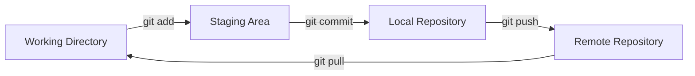

# 🚀 Git e GitHub: Controle e Compartilhe seu Código

<div align="center">


**Projeto prático de controle de versão com Git e GitHub**

</div>

---

## 📋 Índice

- [Sobre o Projeto](#-sobre-o-projeto)
- [O que é Git e GitHub](#-o-que-é-git-e-github)
- [Funcionalidades](#-funcionalidades)
- [Conceitos Fundamentais](#-conceitos-fundamentais)
- [Pré-requisitos](#-pré-requisitos)
- [Instalação](#-instalação)
- [Comandos Git Essenciais](#-comandos-git-essenciais)
- [Fluxo de Trabalho](#-fluxo-de-trabalho)
- [Temas Abordados](#-temas-abordados)
- [Estrutura do Projeto](#-estrutura-do-projeto)
- [Trabalhando com Branches](#-trabalhando-com-branches)
- [Resolução de Conflitos](#%EF%B8%8F-resolução-de-conflitos)
- [GitHub e Colaboração](#-github-e-colaboração)
- [Boas Práticas](#-boas-práticas)
- [Comandos Avançados](#-comandos-avançados)
- [Recursos Adicionais](#-recursos-adicionais)
- [Solução de Problemas](#-solução-de-problemas)
- [Contribuindo](#-contribuindo)
- [Licença](#-licença)
- [Agradecimentos](#-agradecimentos)

---

## 📖 Sobre o Projeto

Este projeto foi desenvolvido como parte do curso **"Git e GitHub: Controle e compartilhe seu código"** da [Alura](https://www.alura.com.br/), uma das principais plataformas de ensino de tecnologia do Brasil.

O objetivo é demonstrar na prática os conceitos fundamentais de **controle de versão** utilizando **Git** e **GitHub**, desde os comandos básicos até técnicas avançadas de colaboração em equipe.

### 🎯 Objetivos do Curso

- 🎓 Compreender o que é controle de versão e sua importância
- 💻 Dominar os comandos essenciais do Git
- 🌐 Aprender a usar o GitHub para compartilhar projetos
- 🤝 Trabalhar em equipe com branches e pull requests
- 🔄 Resolver conflitos de merge de forma eficiente
- 📦 Criar releases e gerenciar versões do software
- 🏷️ Utilizar tags para marcar versões importantes

---

## 🤔 O que é Git e GitHub?

### 🔧 Git

**Git** é um sistema de controle de versão distribuído, criado por Linus Torvalds em 2005. Ele permite:

- 📝 Rastrear todas as alterações no código ao longo do tempo
- ⏮️ Reverter para versões anteriores quando necessário
- 🌿 Criar ramificações (branches) para desenvolver features isoladamente
- 🔀 Mesclar (merge) mudanças de diferentes desenvolvedores
- 🚀 Trabalhar offline e sincronizar depois

**Vantagens do Git:**
- ✅ Gratuito e open source
- ✅ Distribuído (cada desenvolvedor tem histórico completo)
- ✅ Rápido e eficiente
- ✅ Suporta desenvolvimento não-linear (branches)
- ✅ Integridade de dados garantida

### 🌐 GitHub

**GitHub** é uma plataforma de hospedagem de código que utiliza Git. Oferece:

- ☁️ Armazenamento remoto de repositórios
- 👥 Ferramentas de colaboração (pull requests, code review)
- 🐛 Sistema de issues para rastreamento de bugs
- 📊 Visualização de histórico e estatísticas
- 🔒 Controle de acesso e permissões
- 🤖 GitHub Actions para CI/CD
- 📖 GitHub Pages para hospedar sites estáticos

---

## ✨ Funcionalidades

### Controle de Versão
- ✅ Salvar snapshots do código em diferentes momentos
- ✅ Recuperar versões anteriores do projeto
- ✅ Ver histórico completo de alterações
- ✅ Identificar quem fez cada mudança e quando
- ✅ Comparar diferentes versões do código

### Colaboração em Equipe
- ✅ Múltiplos desenvolvedores trabalhando simultaneamente
- ✅ Branches para isolar desenvolvimento de features
- ✅ Merge de código de diferentes contribuidores
- ✅ Code review através de pull requests
- ✅ Resolução de conflitos de forma estruturada

### Gerenciamento de Releases
- ✅ Criar tags para marcar versões
- ✅ Gerar releases no GitHub
- ✅ Versionamento semântico (SemVer)
- ✅ Changelog para documentar mudanças

### Backup e Compartilhamento
- ✅ Repositórios remotos como backup
- ✅ Compartilhar código com a comunidade
- ✅ Contribuir com projetos open source
- ✅ Portfólio profissional no GitHub

---

## 🧠 Conceitos Fundamentais

### Repositório (Repository)
Local onde o projeto e seu histórico são armazenados. Pode ser:
- **Local** - Na sua máquina
- **Remoto** - No GitHub, GitLab, Bitbucket, etc.

### Commit
Snapshot do código em um momento específico. Cada commit representa um conjunto de mudanças.

### Branch
Ramificação independente do código, permitindo desenvolvimento paralelo.

### Merge
Processo de integrar mudanças de uma branch em outra.

### Pull Request (PR)
Solicitação para mesclar código de uma branch em outra, com revisão.

### Clone
Cópia de um repositório remoto para sua máquina local.

### Fork
Cópia de um repositório de outra pessoa para sua conta GitHub.

### Staging Area
Área intermediária onde as alterações são preparadas antes do commit.

### Working Directory
Diretório de trabalho com os arquivos do projeto.

---

## 📋 Pré-requisitos

### Software Necessário

- **[Git 2.30+](https://git-scm.com/downloads)** - Sistema de controle de versão
- **[Conta no GitHub](https://github.com/signup)** - Para repositórios remotos (gratuita)
- **Editor de texto** - Visual Studio Code, Sublime Text, ou qualquer editor

### Conhecimentos Recomendados

- Noções básicas de linha de comando (terminal/prompt)
- Conhecimento básico de programação
- Familiaridade com estrutura de arquivos e pastas

### Verificar Instalação

```bash
# Verificar versão do Git
git --version

# Configurar Git (primeira vez)
git config --global user.name "Seu Nome"
git config --global user.email "seu.email@exemplo.com"

# Verificar configuração
git config --list
```

---

## 🚀 Instalação

### Instalando o Git

#### Windows
1. Baixe o instalador em [git-scm.com](https://git-scm.com/download/win)
2. Execute o instalador
3. Siga as opções padrão (recomendado)
4. Abra o Git Bash ou CMD para usar

#### Linux (Ubuntu/Debian)
```bash
sudo apt update
sudo apt install git
```

#### Linux (Fedora)
```bash
sudo dnf install git
```

#### macOS
```bash
# Com Homebrew
brew install git

# Ou baixe do site oficial
```

### Configuração Inicial

```bash
# Configurar identidade (obrigatório)
git config --global user.name "João Martins"
git config --global user.email "joao.martins@email.com"

# Configurar editor padrão
git config --global core.editor "code --wait"  # VS Code
# ou
git config --global core.editor "vim"  # Vim

# Configurar branch padrão como main
git config --global init.defaultBranch main

# Cores no terminal (facilita leitura)
git config --global color.ui true

# Visualizar configurações
git config --list
```

---

## 🎓 Temas Abordados

### 1️⃣ O que é Git e GitHub?

**Conceitos aprendidos:**
- 📚 História e criação do Git
- 🔄 Diferença entre Git (ferramenta) e GitHub (plataforma)
- 💡 Por que usar controle de versão
- 🏢 Aplicações no mercado de trabalho
- 🌍 Alternativas ao GitHub (GitLab, Bitbucket)

**Entendimentos:**
- Sistema de controle de versão distribuído
- Rastreamento de mudanças em arquivos
- Colaboração eficiente em projetos de software
- Histórico completo de desenvolvimento

---

### 2️⃣ Entenda um Sistema de Controle de Versão

**Conceitos aprendidos:**
- 📂 Repositórios locais e remotos
- 📸 Snapshots vs. mudanças delta
- 🔐 Integridade de dados com hash SHA-1
- 📊 Estados dos arquivos: modified, staged, committed
- 🗂️ Working directory, staging area e repository

**Diagrama de Estados:**
```
Working Directory  →  Staging Area  →  Repository (.git)
   (modificado)    →    (staged)     →   (committed)
```

---

### 3️⃣ Salve e Recupere seu Código em Diferentes Versões

**Conceitos aprendidos:**
- 💾 Criando commits significativos
- 📝 Mensagens de commit descritivas
- 🕐 Navegando pelo histórico
- ⏪ Revertendo mudanças indesejadas
- 🔍 Visualizando diferenças entre versões

**Comandos principais:**
```bash
git add arquivo.txt          # Adicionar arquivo ao staging
git commit -m "mensagem"     # Criar commit
git log                      # Ver histórico
git diff                     # Ver diferenças
git checkout commit-hash     # Voltar para versão anterior
git revert commit-hash       # Reverter commit específico
```

---

### 4️⃣ Resolva Merges e Conflitos

**Conceitos aprendidos:**
- 🔀 O que são merges
- ⚠️ Como surgem conflitos
- 🛠️ Resolução manual de conflitos
- 🔧 Ferramentas de merge (mergetool)
- ✅ Boas práticas para evitar conflitos

**Fluxo de resolução:**
```bash
# 1. Tentar fazer merge
git merge feature-branch

# 2. Se houver conflito, editar arquivos manualmente
# 3. Marcar como resolvido
git add arquivo-conflitado.txt

# 4. Finalizar merge
git commit -m "Resolve conflito entre branches"
```

**Exemplo de conflito:**
```
<<<<<<< HEAD
Código da branch atual
=======
Código da branch sendo mesclada
>>>>>>> feature-branch
```

---

### 5️⃣ Trabalhe com Diferentes Branches

**Conceitos aprendidos:**
- 🌿 O que são branches e por que usar
- 🎯 Branch main/master (principal)
- 🔨 Branches de feature, bugfix, hotfix
- 🔄 Criação, troca e exclusão de branches
- 🌳 Visualização da árvore de branches

**Estratégias de branching:**
```
main (produção)
  ├── develop (desenvolvimento)
  │   ├── feature/login
  │   ├── feature/dashboard
  │   └── bugfix/correcao-header
  └── hotfix/seguranca-critica
```

**Comandos de branches:**
```bash
git branch                      # Listar branches
git branch feature-login        # Criar branch
git checkout feature-login      # Trocar de branch
git checkout -b feature-nova    # Criar e trocar
git merge feature-login         # Mesclar branch
git branch -d feature-login     # Deletar branch (após merge)
git branch -D feature-login     # Forçar deleção
```

---

### 6️⃣ Iniciando os Trabalhos

**Conceitos aprendidos:**
- 🆕 Inicializar repositório Git (`git init`)
- 📥 Clonar repositório existente (`git clone`)
- 📄 Arquivo `.gitignore` e sua importância
- 🏗️ Estrutura de um repositório Git
- 📋 Primeiro commit

**Iniciando um projeto do zero:**
```bash
# Criar diretório do projeto
mkdir meu-projeto
cd meu-projeto

# Inicializar repositório Git
git init

# Criar arquivo
echo "# Meu Projeto" > README.md

# Adicionar e commitar
git add README.md
git commit -m "Commit inicial: adiciona README"
```

**Clonando projeto existente:**
```bash
# Clonar repositório
git clone https://github.com/usuario/projeto.git
cd projeto

# Verificar status
git status
```

---

### 7️⃣ Compartilhando o Trabalho

**Conceitos aprendidos:**
- ☁️ Repositórios remotos (origin)
- 📤 Push: enviando commits para o remoto
- 📥 Pull: baixando atualizações do remoto
- 🔗 Conectar repositório local ao GitHub
- 🔑 Autenticação SSH vs. HTTPS

**Conectar ao GitHub:**
```bash
# Adicionar remote origin
git remote add origin https://github.com/usuario/projeto.git

# Enviar código para GitHub
git push -u origin main

# Listar remotes configurados
git remote -v

# Baixar atualizações
git pull origin main
```

**Criando repositório no GitHub:**
1. Acesse github.com
2. Clique em "New repository"
3. Preencha nome e descrição
4. Escolha público ou privado
5. Siga instruções para conectar repositório local

---

### 8️⃣ Trabalhando em Equipe

**Conceitos aprendidos:**
- 👥 Colaboração com múltiplos desenvolvedores
- 🔄 Fork e pull request (PR)
- 👀 Code review e aprovações
- 💬 Comentários em pull requests
- ✅ Merge de PRs

**Fluxo de colaboração:**
```
1. Fork do repositório original
2. Clone do seu fork
3. Criar branch para feature
4. Fazer commits das mudanças
5. Push para seu fork
6. Abrir Pull Request no repositório original
7. Code review e discussão
8. Merge do PR (após aprovação)
```

**Comandos para trabalho em equipe:**
```bash
# Adicionar upstream (repositório original)
git remote add upstream https://github.com/original/projeto.git

# Atualizar seu fork com mudanças do original
git fetch upstream
git merge upstream/main

# Ou com rebase
git pull --rebase upstream main

# Enviar branch para revisão
git push origin feature-nova-funcionalidade
```

---

### 9️⃣ Manipulando as Versões

**Conceitos aprendidos:**
- 📜 Visualização avançada de histórico
- 🔍 Git log com filtros e formatação
- 📊 Git blame para rastrear autores
- 🎯 Checkout de commits específicos
- 🔄 Reset, revert e restore
- 📝 Amend para corrigir último commit

**Comandos de manipulação:**
```bash
# Histórico detalhado
git log --oneline --graph --all --decorate

# Ver mudanças de um commit
git show commit-hash

# Ver quem modificou cada linha
git blame arquivo.txt

# Voltar arquivo para versão anterior
git checkout commit-hash -- arquivo.txt

# Desfazer último commit (mantém mudanças)
git reset --soft HEAD~1

# Desfazer último commit (descarta mudanças)
git reset --hard HEAD~1

# Corrigir mensagem do último commit
git commit --amend -m "Nova mensagem"

# Adicionar arquivo esquecido ao último commit
git add arquivo-esquecido.txt
git commit --amend --no-edit
```

---

### 🔟 Gerando Entregas

**Conceitos aprendidos:**
- 🏷️ Tags para marcar versões
- 📦 Criação de releases no GitHub
- 📋 Versionamento semântico (SemVer)
- 📝 Changelog e notas de release
- 🎁 Distribuição de versões estáveis

**Versionamento Semântico:**
```
MAJOR.MINOR.PATCH
  1  .  0  .  0

MAJOR: Mudanças incompatíveis (breaking changes)
MINOR: Novas funcionalidades (compatíveis)
PATCH: Correções de bugs
```

**Comandos de tags:**
```bash
# Criar tag leve
git tag v1.0.0

# Criar tag anotada (recomendado)
git tag -a v1.0.0 -m "Versão 1.0.0 - Release inicial"

# Listar tags
git tag

# Enviar tag para remoto
git push origin v1.0.0

# Enviar todas as tags
git push origin --tags

# Deletar tag local
git tag -d v1.0.0

# Deletar tag remota
git push origin --delete v1.0.0

# Fazer checkout de uma tag
git checkout v1.0.0
```

---

## 📁 Estrutura do Projeto

```
git-github-management-main/
│
├── index.html                 # Arquivo HTML de exemplo do projeto
├── README.md                  # Documentação original do curso
└── .git/                      # Diretório Git (oculto, criado após git init)
    ├── objects/               # Objetos Git (commits, trees, blobs)
    ├── refs/                  # Referências (branches, tags)
    ├── HEAD                   # Ponteiro para branch atual
    └── config                 # Configurações do repositório
```

### Arquivo: index.html

O projeto contém uma página HTML simples listando cursos da Alura:
- Vagrant
- Docker
- Ansible
- Integração Contínua

Este arquivo serve como exemplo prático para demonstrar:
- Criação de commits
- Modificações e rastreamento
- Trabalho com branches
- Resolução de conflitos

---

## 📝 Comandos Git Essenciais

### Configuração

```bash
# Configurar nome de usuário
git config --global user.name "Seu Nome"

# Configurar email
git config --global user.email "email@exemplo.com"

# Verificar configurações
git config --list
```

### Inicialização

```bash
# Inicializar repositório novo
git init

# Clonar repositório existente
git clone https://github.com/usuario/repositorio.git

# Clonar em diretório específico
git clone https://github.com/usuario/repositorio.git meu-diretorio
```

### Básicos do Dia a Dia

```bash
# Ver status dos arquivos
git status

# Adicionar arquivo específico
git add index.html

# Adicionar todos os arquivos modificados
git add .

# Criar commit
git commit -m "Adiciona página inicial"

# Add + commit em um comando (apenas tracked files)
git commit -am "Atualiza conteúdo"

# Ver histórico de commits
git log
git log --oneline              # Versão compacta
git log --graph --all          # Com visualização de branches
```

### Trabalhando com Remotes

```bash
# Adicionar remote
git remote add origin https://github.com/usuario/repo.git

# Listar remotes
git remote -v

# Enviar mudanças para remoto
git push origin main

# Baixar mudanças do remoto
git pull origin main

# Fetch (baixa sem fazer merge)
git fetch origin
```

### Branches

```bash
# Listar branches
git branch
git branch -a                  # Incluir remotas

# Criar branch
git branch feature-nova

# Trocar de branch
git checkout feature-nova
git switch feature-nova        # Comando moderno

# Criar e trocar em um comando
git checkout -b feature-nova
git switch -c feature-nova     # Comando moderno

# Mesclar branch
git merge feature-nova

# Deletar branch
git branch -d feature-nova
git push origin --delete feature-nova  # Deletar remota
```

### Desfazendo Mudanças

```bash
# Descartar mudanças não commitadas
git restore arquivo.txt
git checkout -- arquivo.txt    # Comando antigo

# Remover arquivo do staging
git restore --staged arquivo.txt
git reset HEAD arquivo.txt     # Comando antigo

# Voltar para commit anterior (preserva histórico)
git revert commit-hash

# Resetar para commit anterior (reescreve histórico)
git reset --soft commit-hash   # Mantém mudanças no staging
git reset --mixed commit-hash  # Mantém mudanças no working dir
git reset --hard commit-hash   # APAGA todas as mudanças
```

---

## 🔄 Fluxo de Trabalho

### Fluxo Básico Individual



**Passo a passo:**
```bash
# 1. Modificar arquivos
vim index.html

# 2. Ver o que mudou
git status
git diff

# 3. Adicionar ao staging
git add index.html

# 4. Commitar
git commit -m "Adiciona curso de Kubernetes"

# 5. Enviar para GitHub
git push origin main
```

### Fluxo de Trabalho em Equipe

```bash
# 1. Atualizar repositório local
git pull origin main

# 2. Criar branch para feature
git checkout -b feature/novo-curso

# 3. Fazer modificações e commits
git add .
git commit -m "Adiciona curso de Python"

# 4. Enviar branch para GitHub
git push origin feature/novo-curso

# 5. Criar Pull Request no GitHub
# (Feito pela interface web)

# 6. Após aprovação e merge, atualizar main local
git checkout main
git pull origin main

# 7. Deletar branch local
git branch -d feature/novo-curso
```

---

## 🌿 Trabalhando com Branches

### Por que usar Branches?

- 🎯 **Isolamento** - Desenvolver features sem afetar código estável
- 🔒 **Segurança** - Branch main sempre funcional
- 🤝 **Colaboração** - Múltiplas pessoas trabalhando em paralelo
- 🧪 **Experimentação** - Testar ideias sem comprometer projeto
- 📦 **Organização** - Separar tipos de trabalho (feature, bugfix, hotfix)

### Estratégias de Branching

#### Git Flow (Tradicional)
```
main           - Produção
  └── develop  - Desenvolvimento
      ├── feature/login
      ├── feature/carrinho
      └── release/v1.0
```

#### GitHub Flow (Simplificado)
```
main           - Única branch principal
  ├── feature/nova-funcionalidade
  ├── bugfix/correcao-erro
  └── hotfix/seguranca
```

### Exemplo Prático com o Projeto

```bash
# 1. Criar branch para adicionar novo curso
git checkout -b feature/adiciona-kubernetes

# 2. Modificar index.html
echo "        <li>Kubernetes</li>" >> index.html

# 3. Commitar mudança
git add index.html
git commit -m "Adiciona curso de Kubernetes à lista"

# 4. Voltar para main
git checkout main

# 5. Mesclar feature
git merge feature/adiciona-kubernetes

# 6. Deletar branch da feature
git branch -d feature/adiciona-kubernetes
```

---

## ⚔️ Resolução de Conflitos

### Quando Conflitos Acontecem?

Conflitos ocorrem quando:
- Duas pessoas editam a mesma linha do mesmo arquivo
- Uma pessoa deleta um arquivo que outra editou
- Mudanças incompatíveis são feitas em branches diferentes

### Passo a Passo para Resolver

#### 1. Identificar o conflito
```bash
git merge feature-branch
# Output: CONFLICT (content): Merge conflict in index.html
# Automatic merge failed; fix conflicts and then commit the result.
```

#### 2. Ver arquivos em conflito
```bash
git status
# Output mostrará arquivos com "both modified"
```

#### 3. Abrir arquivo e resolver manualmente
```html
<<<<<<< HEAD
    <li>Docker</li>
    <li>Ansible</li>
=======
    <li>Ansible</li>
    <li>Docker</li>
>>>>>>> feature-branch
```

**Escolher versão correta:**
```html
    <li>Ansible</li>
    <li>Docker</li>
```

#### 4. Marcar como resolvido
```bash
git add index.html
```

#### 5. Finalizar merge
```bash
git commit -m "Resolve conflito na ordem dos cursos"
```

### Ferramentas para Resolução

```bash
# Usar ferramenta visual de merge
git mergetool

# Abortar merge e voltar ao estado anterior
git merge --abort

# Ver conflitos de forma mais clara
git diff --conflict=diff3
```

---

## 🐙 GitHub e Colaboração

### Criando Repositório no GitHub

1. **Acesse** [github.com/new](https://github.com/new)
2. **Preencha:**
   - Nome do repositório
   - Descrição (opcional)
   - Público ou Privado
   - Inicializar com README (opcional)
3. **Crie** o repositório

### Conectando Repositório Local

```bash
# Método HTTPS (mais simples)
git remote add origin https://github.com/usuario/repo.git
git push -u origin main

# Método SSH (mais seguro, requer configuração)
git remote add origin git@github.com:usuario/repo.git
git push -u origin main
```

### Pull Requests (PRs)

**O que são Pull Requests?**
- Solicitação para mesclar código de uma branch em outra
- Permite revisão de código antes do merge
- Facilita discussão sobre mudanças
- Registra histórico de decisões

**Fluxo de Pull Request:**

1. **Criar branch e fazer mudanças**
   ```bash
   git checkout -b feature/novo-recurso
   # Fazer modificações
   git add .
   git commit -m "Implementa novo recurso"
   git push origin feature/novo-recurso
   ```

2. **Abrir PR no GitHub**
   - Acesse o repositório no GitHub
   - Clique em "Pull requests" → "New pull request"
   - Selecione branches (base: main ← compare: feature/novo-recurso)
   - Adicione título e descrição detalhada
   - Atribua revisores (reviewers)
   - Clique em "Create pull request"

3. **Code Review**
   - Revisores analisam o código
   - Comentam sugestões de melhoria
   - Aprovam ou solicitam mudanças

4. **Merge**
   - Após aprovação, fazer merge
   - Opções: Merge commit, Squash, Rebase
   - Deletar branch após merge

### Issues (Rastreamento de Tarefas)

```markdown
**Issues** são usadas para:
- 🐛 Reportar bugs
- ✨ Sugerir novas features
- 📝 Documentar tarefas
- ❓ Fazer perguntas

**Boas práticas:**
- Título claro e descritivo
- Descrição detalhada do problema/sugestão
- Labels para categorização (bug, enhancement, documentation)
- Assignees para designar responsáveis
- Milestones para agrupar issues relacionadas
```

---

## 🎯 Boas Práticas

### Commits

#### ✅ Boas Mensagens de Commit

```bash
# Formato recomendado
git commit -m "Tipo: descrição curta

Descrição detalhada do que foi feito e por quê.

Refs #123"
```

**Tipos comuns:**
- `feat:` Nova funcionalidade
- `fix:` Correção de bug
- `docs:` Documentação
- `style:` Formatação (sem mudança de lógica)
- `refactor:` Refatoração de código
- `test:` Adição ou correção de testes
- `chore:` Tarefas de manutenção

**Exemplos:**
```bash
git commit -m "feat: adiciona curso de Kubernetes à lista"
git commit -m "fix: corrige link quebrado no README"
git commit -m "docs: atualiza instruções de instalação"
git commit -m "refactor: reorganiza estrutura de pastas"
```

#### ❌ Evite
```bash
git commit -m "mudanças"
git commit -m "fix"
git commit -m "atualizações várias"
git commit -m "WIP"  # Work in Progress (não comitar WIP)
```

### Branches

#### ✅ Nomenclatura de Branches

```bash
# Padrão: tipo/descrição-curta
feature/adiciona-login
feature/novo-dashboard
bugfix/corrige-menu
hotfix/falha-seguranca
docs/atualiza-readme
refactor/melhora-performance
```

#### ❌ Evite
```bash
branch1
teste
nova
minha-branch
```

### .gitignore

**Sempre ignore:**
```gitignore
# Dependências
node_modules/
vendor/
*.pyc
__pycache__/

# Arquivos de sistema
.DS_Store
Thumbs.db
*.swp
*.swo

# IDEs
.vscode/
.idea/
*.sublime-*

# Builds
dist/
build/
*.exe
*.dll

# Ambiente
.env
.env.local
secrets.yml

# Logs
*.log
logs/
```

### Workflow em Equipe

1. **Sempre pull antes de começar**
   ```bash
   git pull origin main
   ```

2. **Commits pequenos e frequentes**
   - Melhor do que um commit gigante
   - Facilita code review
   - Mais fácil de reverter se necessário

3. **Nunca faça push direto na main**
   - Sempre use branches
   - Sempre abra pull request
   - Obtenha aprovação antes do merge

4. **Sincronize regularmente**
   ```bash
   git fetch origin
   git merge origin/main
   ```

5. **Delete branches após merge**
   ```bash
   git branch -d feature-concluida
   git push origin --delete feature-concluida
   ```

---

## 🔧 Comandos Avançados

### Stash (Guardar Mudanças Temporariamente)

```bash
# Guardar mudanças sem commitar
git stash

# Listar stashes
git stash list

# Aplicar último stash
git stash apply

# Aplicar e remover stash
git stash pop

# Guardar com mensagem
git stash save "WIP: implementando login"

# Aplicar stash específico
git stash apply stash@{2}

# Deletar stash
git stash drop stash@{0}
```

### Rebase (Reorganizar Commits)

```bash
# Rebase interativo dos últimos 3 commits
git rebase -i HEAD~3

# Rebase de branch
git checkout feature-branch
git rebase main

# Continuar rebase após resolver conflitos
git rebase --continue

# Abortar rebase
git rebase --abort
```

**Opções no rebase interativo:**
- `pick` - Manter commit
- `reword` - Mudar mensagem
- `edit` - Editar commit
- `squash` - Mesclar com commit anterior
- `drop` - Remover commit

### Cherry-pick (Aplicar Commit Específico)

```bash
# Aplicar commit de outra branch
git cherry-pick commit-hash

# Cherry-pick múltiplos commits
git cherry-pick commit1 commit2 commit3
```

### Reflog (Histórico de Referências)

```bash
# Ver histórico completo de mudanças de HEAD
git reflog

# Recuperar commit "perdido"
git checkout commit-hash

# Recuperar branch deletada
git checkout -b branch-recuperada commit-hash
```

### Bisect (Encontrar Bug com Busca Binária)

```bash
# Iniciar bisect
git bisect start

# Marcar commit atual como ruim
git bisect bad

# Marcar commit antigo funcionando como bom
git bisect good commit-hash

# Git vai testando commits intermediários
# Você marca cada um como good ou bad
git bisect good
git bisect bad

# Quando encontrar o commit problemático
git bisect reset
```

---

## 🎨 Visualização e Histórico

### Comandos de Log Avançados

```bash
# Log formatado com gráfico
git log --oneline --graph --all --decorate

# Log com estatísticas de mudanças
git log --stat

# Log com diferenças completas
git log -p

# Log dos últimos 5 commits
git log -5

# Log por autor
git log --author="João Martins"

# Log por período
git log --since="2 weeks ago"
git log --after="2024-01-01" --before="2024-12-31"

# Log de um arquivo específico
git log -- index.html

# Log com busca na mensagem
git log --grep="bugfix"

# Log formatado customizado
git log --pretty=format:"%h - %an, %ar : %s"
```

### Aliases (Atalhos)

```bash
# Criar aliases úteis
git config --global alias.st status
git config --global alias.co checkout
git config --global alias.br branch
git config --global alias.ci commit
git config --global alias.unstage 'reset HEAD --'
git config --global alias.last 'log -1 HEAD'
git config --global alias.lg 'log --oneline --graph --all --decorate'

# Usar aliases
git st                # Equivale a git status
git lg                # Log formatado
git last              # Último commit
```

---

## 📚 Casos de Uso Práticos

### Cenário 1: Começando um Projeto Novo

```bash
# Criar diretório
mkdir meu-site
cd meu-site

# Inicializar Git
git init

# Criar arquivos
echo "# Meu Site" > README.md
echo "<h1>Meu Site</h1>" > index.html

# Criar .gitignore
cat > .gitignore << EOF
.DS_Store
*.log
node_modules/
EOF

# Primeiro commit
git add .
git commit -m "feat: estrutura inicial do projeto"

# Criar repositório no GitHub e conectar
git remote add origin https://github.com/usuario/meu-site.git
git push -u origin main
```

### Cenário 2: Contribuindo com Projeto Open Source

```bash
# 1. Fork o projeto no GitHub (botão Fork)

# 2. Clonar seu fork
git clone https://github.com/seu-usuario/projeto.git
cd projeto

# 3. Adicionar upstream
git remote add upstream https://github.com/usuario-original/projeto.git

# 4. Criar branch para contribuição
git checkout -b fix/corrige-bug-123

# 5. Fazer mudanças e commitar
git add .
git commit -m "fix: corrige bug no cálculo de preço (#123)"

# 6. Push para seu fork
git push origin fix/corrige-bug-123

# 7. Abrir Pull Request no GitHub original

# 8. Manter fork atualizado
git fetch upstream
git checkout main
git merge upstream/main
git push origin main
```

### Cenário 3: Trabalhando com Sua Equipe

```bash
# Dia 1: Pegar nova tarefa
git checkout main
git pull origin main
git checkout -b feature/adiciona-validacao

# Trabalhar na feature por alguns dias
git add .
git commit -m "feat: adiciona validação de email"
git push origin feature/adiciona-validacao

# Dia 2: Continuar trabalho
git pull origin feature/adiciona-validacao  # Caso alguém atualizou
# Continuar desenvolvimento...

# Dia 3: Finalizar e preparar PR
git add .
git commit -m "feat: completa validação de formulário"
git push origin feature/adiciona-validacao

# Atualizar branch com main (antes de abrir PR)
git fetch origin
git merge origin/main  # Resolver conflitos se houver
git push origin feature/adiciona-validacao

# Abrir Pull Request no GitHub
```

---

## 🐛 Solução de Problemas

### Erro: fatal: not a git repository

**Problema:** Tentou usar git fora de um repositório

**Solução:**
```bash
# Verificar se está no diretório correto
pwd

# Inicializar repositório se necessário
git init
```

### Erro: Author identity unknown

**Problema:** Git não está configurado

**Solução:**
```bash
git config --global user.name "Seu Nome"
git config --global user.email "seu.email@exemplo.com"
```

### Erro: Updates were rejected (push rejected)

**Problema:** Repositório remoto tem commits que você não tem localmente

**Solução:**
```bash
# Baixar mudanças primeiro
git pull origin main

# Resolver conflitos se houver, depois
git push origin main
```

### Erro: You have divergent branches

**Problema:** Históricos local e remoto divergiram

**Solução:**
```bash
# Opção 1: Merge
git pull origin main

# Opção 2: Rebase (mais limpo)
git pull --rebase origin main

# Opção 3: Forçar push (CUIDADO!)
git push --force origin main  # Só use se tiver certeza!
```

### Desfazer Commit que já foi Enviado (Push)

**Problema:** Fez push de commit errado

**Solução:**
```bash
# Opção 1: Revert (cria novo commit desfazendo, recomendado)
git revert HEAD
git push origin main

# Opção 2: Reset e force push (reescreve história, PERIGOSO!)
git reset --hard HEAD~1
git push --force origin main  # Só em branches pessoais!
```

### Recuperar Arquivo Deletado

```bash
# Recuperar arquivo do último commit
git checkout HEAD -- arquivo.txt

# Recuperar arquivo de commit específico
git checkout commit-hash -- arquivo.txt

# Encontrar quando arquivo foi deletado
git log --all --full-history -- arquivo.txt

# Recuperar do commit antes da deleção
git checkout commit-hash~1 -- arquivo.txt
```

---

## 📖 Glossário Git

| Termo | Descrição |
|-------|-----------|
| **Repository** | Banco de dados com histórico completo do projeto |
| **Commit** | Snapshot do código em um momento específico |
| **Branch** | Linha independente de desenvolvimento |
| **Merge** | Integração de mudanças de branches diferentes |
| **Clone** | Cópia local de repositório remoto |
| **Fork** | Cópia de repositório para sua conta |
| **Pull Request** | Solicitação de merge com revisão de código |
| **Push** | Enviar commits para repositório remoto |
| **Pull** | Baixar commits de repositório remoto |
| **Fetch** | Baixar informações sem fazer merge |
| **Checkout** | Trocar de branch ou restaurar arquivos |
| **Staging Area** | Área de preparação antes do commit |
| **HEAD** | Ponteiro para o commit atual |
| **Origin** | Nome padrão do repositório remoto principal |
| **Upstream** | Repositório original (em forks) |
| **Conflict** | Quando Git não consegue mesclar automaticamente |
| **Tag** | Marcador de versão específica |
| **Release** | Versão empacotada para distribuição |
| **Stash** | Armazenamento temporário de mudanças |
| **Rebase** | Reorganização do histórico de commits |
| **Cherry-pick** | Aplicar commit específico de outra branch |

---

## 🎓 Estrutura das Aulas

### Aula 1: O que é Git?
**Duração estimada:** 30-40 minutos

**Conteúdo:**
- Introdução ao controle de versão
- História do Git
- Instalação e configuração
- Conceitos básicos: repositório, commit, branch

**Atividades práticas:**
- Instalar Git
- Configurar usuário e email
- Criar primeiro repositório local

---

### Aula 2: Iniciando os Trabalhos
**Duração estimada:** 40-50 minutos

**Conteúdo:**
- Inicialização de repositório (`git init`)
- Primeiro commit
- Área de staging
- Status e histórico
- Arquivo .gitignore

**Atividades práticas:**
- Criar projeto HTML simples
- Fazer commits das mudanças
- Visualizar histórico

---

### Aula 3: Compartilhando o Trabalho
**Duração estimada:** 40-50 minutos

**Conteúdo:**
- O que é GitHub
- Criação de conta
- Criar repositório remoto
- Push e pull
- Clone de repositórios

**Atividades práticas:**
- Criar repositório no GitHub
- Conectar repositório local ao remoto
- Fazer push do código
- Clonar repositório existente

---

### Aula 4: Trabalhando em Equipe
**Duração estimada:** 50-60 minutos

**Conteúdo:**
- Fork e pull requests
- Code review
- Colaboração em projetos
- Issues e projetos

**Atividades práticas:**
- Fork de repositório
- Criar pull request
- Revisar código de colegas
- Merge de pull requests

---

### Aula 5: Manipulando as Versões
**Duração estimada:** 50-60 minutos

**Conteúdo:**
- Navegação pelo histórico
- Desfazer mudanças (reset, revert, restore)
- Visualização avançada de logs
- Correção de commits (amend)

**Atividades práticas:**
- Explorar histórico do projeto
- Reverter commits
- Corrigir mensagens de commit
- Recuperar código de versões anteriores

---

### Aula 6: Gerando Entregas
**Duração estimada:** 40-50 minutos

**Conteúdo:**
- Criação de tags
- Versionamento semântico
- Releases no GitHub
- Changelog

**Atividades práticas:**
- Criar tags de versão
- Gerar release no GitHub
- Documentar mudanças em changelog

---

## 🛠️ Ferramentas Complementares

### Clientes Git com Interface Gráfica

- **[GitHub Desktop](https://desktop.github.com/)** - Cliente oficial do GitHub
- **[GitKraken](https://www.gitkraken.com/)** - Cliente visual poderoso
- **[SourceTree](https://www.sourcetreeapp.com/)** - Da Atlassian
- **[Tower](https://www.git-tower.com/)** - Cliente premium (pago)
- **[Fork](https://git-fork.com/)** - Rápido e clean

### Extensões para Editores

#### Visual Studio Code
- **GitLens** - Superpoderes Git no VS Code
- **Git Graph** - Visualização de branches
- **Git History** - Histórico de arquivos

#### JetBrains IDEs
- Git integration nativa
- Merge tool integrado
- Visualização de branches

### Ferramentas Online

- **[GitHub](https://github.com/)** - Plataforma principal
- **[GitLab](https://gitlab.com/)** - Alternativa com CI/CD integrado
- **[Bitbucket](https://bitbucket.org/)** - Da Atlassian
- **[Gitea](https://gitea.io/)** - Self-hosted, open source

---

## 📊 Exemplo de Projeto Real

### Arquivo HTML do Curso

O projeto contém um arquivo `index.html` simples que lista cursos:

```html
<!DOCTYPE html>
<html lang="en">
<head>
    <meta charset="UTF-8">
    <title>Cursos da Alura</title>
</head>
<body>
    <ul>
        <li>Vagrant</li>
        <li>Docker</li>
        <li>Ansible</li>
        <li>Integração Continua</li>
    </ul>
</body>
</html>
```

### Exercícios Práticos Possíveis

#### Exercício 1: Adicionar Novo Curso
```bash
# Criar branch
git checkout -b feature/adiciona-kubernetes

# Editar index.html (adicionar <li>Kubernetes</li>)

# Commitar
git add index.html
git commit -m "feat: adiciona curso de Kubernetes"

# Merge na main
git checkout main
git merge feature/adiciona-kubernetes
```

#### Exercício 2: Corrigir Ortografia
```bash
# Criar branch
git checkout -b fix/corrige-ortografia

# Corrigir "Continua" para "Contínua"

# Commitar
git add index.html
git commit -m "fix: corrige ortografia de 'Integração Contínua'"

# Push e PR
git push origin fix/corrige-ortografia
```

#### Exercício 3: Simular Conflito
```bash
# Em uma branch, modificar ordem dos cursos
git checkout -b branch-a
# Mudar ordem para: Ansible, Docker, Vagrant
git commit -am "Reorganiza ordem alfabética"

# Em outra branch, também modificar ordem
git checkout main
git checkout -b branch-b
# Mudar ordem para: Docker, Ansible, Vagrant
git commit -am "Reorganiza por popularidade"

# Tentar merge (vai gerar conflito)
git checkout main
git merge branch-a
git merge branch-b  # CONFLITO!

# Resolver conflito manualmente e commitar
```

---

## 🚀 Comandos do Dia a Dia

### Cheat Sheet Rápido

```bash
# ===== INICIALIZAÇÃO =====
git init                              # Iniciar repositório
git clone <url>                       # Clonar repositório

# ===== BÁSICOS =====
git status                            # Ver status
git add <arquivo>                     # Adicionar ao staging
git add .                             # Adicionar tudo
git commit -m "mensagem"              # Commitar
git push origin main                  # Enviar para remoto
git pull origin main                  # Baixar do remoto

# ===== BRANCHES =====
git branch                            # Listar branches
git branch <nome>                     # Criar branch
git checkout <branch>                 # Trocar branch
git checkout -b <branch>              # Criar e trocar
git merge <branch>                    # Mesclar branch
git branch -d <branch>                # Deletar branch

# ===== HISTÓRICO =====
git log                               # Ver histórico
git log --oneline                     # Histórico compacto
git diff                              # Ver diferenças
git show <commit>                     # Ver commit específico

# ===== DESFAZER =====
git restore <arquivo>                 # Descartar mudanças
git restore --staged <arquivo>        # Remover do staging
git reset HEAD~1                      # Desfazer último commit
git revert <commit>                   # Reverter commit

# ===== REMOTO =====
git remote -v                         # Listar remotes
git fetch origin                      # Baixar sem merge
git push origin <branch>              # Enviar branch
git pull origin <branch>              # Baixar e merge

# ===== ÚTEIS =====
git stash                             # Guardar mudanças temporariamente
git stash pop                         # Aplicar stash guardado
git tag v1.0.0                        # Criar tag
git checkout <tag>                    # Ir para tag específica
```

---

## 🎯 Workflows Comuns

### Workflow Pessoal (Desenvolvedor Solo)

```bash
# Sempre trabalhar na main ou criar branches curtas
git pull origin main
# Fazer mudanças
git add .
git commit -m "mensagem"
git push origin main
```

### Workflow de Feature Branch

```bash
# Criar feature branch
git checkout -b feature/nova-funcionalidade

# Desenvolver feature (múltiplos commits)
git add .
git commit -m "feat: parte 1 da funcionalidade"
# ... mais commits ...

# Atualizar com main antes de PR
git fetch origin
git merge origin/main

# Push e criar PR
git push origin feature/nova-funcionalidade
```

### Workflow de Gitflow

```bash
# Branch de desenvolvimento permanente
git checkout -b develop

# Feature branches saem de develop
git checkout -b feature/login

# Após conclusão, merge em develop
git checkout develop
git merge feature/login

# Release branch para preparar lançamento
git checkout -b release/1.0.0

# Após testes, merge em main e develop
git checkout main
git merge release/1.0.0
git tag v1.0.0
git checkout develop
git merge release/1.0.0
```

---

## 📊 Estatísticas e Insights

### Analisar Contribuições

```bash
# Número de commits por autor
git shortlog -sn

# Estatísticas detalhadas
git log --author="João" --stat

# Linhas adicionadas/removidas por autor
git log --author="João" --pretty=tformat: --numstat | \
awk '{ add += $1; subs += $2 } END { print "Adicionadas:",add,"Removidas:",subs }'

# Commits por data
git log --date=short --pretty=format:"%ad" | sort | uniq -c

# Arquivos mais modificados
git log --pretty=format: --name-only | sort | uniq -c | sort -rg | head -10
```

---

## 🔐 Segurança e Autenticação

### Autenticação HTTPS (Token)

```bash
# GitHub agora requer Personal Access Token
# 1. Gerar token: GitHub → Settings → Developer settings → Personal access tokens
# 2. Selecionar scopes: repo, workflow
# 3. Copiar token gerado

# Usar token como senha ao fazer push
git push origin main
Username: seu-usuario
Password: [colar token aqui]

# Salvar credenciais (opcional)
git config --global credential.helper store
```

### Autenticação SSH (Recomendado)

```bash
# 1. Gerar chave SSH
ssh-keygen -t ed25519 -C "seu.email@exemplo.com"

# 2. Copiar chave pública
cat ~/.ssh/id_ed25519.pub

# 3. Adicionar no GitHub: Settings → SSH and GPG keys → New SSH key

# 4. Testar conexão
ssh -T git@github.com

# 5. Usar URL SSH
git remote set-url origin git@github.com:usuario/repo.git
```

---

## 🎨 Personalizações Úteis

### Git Config Avançado

```bash
# Colorir output
git config --global color.ui auto

# Editor padrão
git config --global core.editor "code --wait"

# Merge tool
git config --global merge.tool vimdiff

# Linha de comando mais limpa
git config --global core.pager 'less -FRSX'

# Auto-correção de comandos
git config --global help.autocorrect 1

# Mostrar branch no prompt
# Adicionar ao ~/.bashrc ou ~/.zshrc:
parse_git_branch() {
    git branch 2> /dev/null | sed -e '/^[^*]/d' -e 's/* \(.*\)/(\1)/'
}
PS1="\[\033[01;32m\]\u@\h\[\033[00m\]:\[\033[01;34m\]\w\[\033[33m\]\$(parse_git_branch)\[\033[00m\]\$ "
```

---

## 📚 Recursos Adicionais

### Documentação Oficial

- **[Git Documentation](https://git-scm.com/doc)** - Documentação completa oficial
- **[Pro Git Book](https://git-scm.com/book/pt-br/v2)** - Livro gratuito em português
- **[GitHub Docs](https://docs.github.com/pt)** - Documentação do GitHub
- **[Git Reference](https://git-scm.com/docs)** - Referência de comandos

### Cursos Recomendados

- **[Alura - Git e GitHub: Controle e compartilhe seu código](https://www.alura.com.br/)** - Curso base deste projeto ⭐
- **[Alura - Git e GitHub: Estratégias de ramificação, Conflitos e Pull Requests](https://www.alura.com.br/)**
- **[GitHub Learning Lab](https://lab.github.com/)** - Tutoriais interativos gratuitos
- **[Codecademy - Learn Git](https://www.codecademy.com/learn/learn-git)** - Curso interativo

### Tutoriais Interativos

- **[Learn Git Branching](https://learngitbranching.js.org/?locale=pt_BR)** - Visualização interativa de Git
- **[Git Immersion](http://gitimmersion.com/)** - Tour guiado pelo Git
- **[GitHub Skills](https://skills.github.com/)** - Exercícios práticos
- **[Git Katas](https://github.com/eficode-academy/git-katas)** - Exercícios de treino

### Guias e Cheat Sheets

- **[GitHub Git Cheat Sheet](https://education.github.com/git-cheat-sheet-education.pdf)** - PDF oficial
- **[Atlassian Git Tutorials](https://www.atlassian.com/git/tutorials)** - Tutoriais detalhados
- **[Git Explorer](https://gitexplorer.com/)** - Encontre o comando certo
- **[Oh Shit, Git!?!](https://ohshitgit.com/)** - Como consertar erros comuns

### Livros

- **"Pro Git"** - Scott Chacon e Ben Straub (gratuito online)
- **"Git Pocket Guide"** - Richard E. Silverman
- **"Version Control with Git"** - Jon Loeliger

### Vídeos e Canais

- [Curso em Vídeo - Git e GitHub](https://www.youtube.com/playlist?list=PLHz_AreHm4dm7ZULPAmadvNhH6vk9oNZA) - Gustavo Guanabara
- [Rocketseat - Git e GitHub para iniciantes](https://www.youtube.com/watch?v=2alg7MQ6_sI)
- [Traversy Media - Git & GitHub Crash Course](https://www.youtube.com/watch?v=SWYqp7iY_Tc) (inglês)

---

## 🏆 Competências Desenvolvidas

Ao completar este curso e projeto, você terá domínio sobre:

### Técnicas
- ✅ Inicializar e configurar repositórios Git
- ✅ Criar commits significativos e organizados
- ✅ Trabalhar com branches de forma eficiente
- ✅ Resolver conflitos de merge
- ✅ Usar GitHub para colaboração
- ✅ Criar pull requests e fazer code review
- ✅ Gerenciar versões com tags e releases
- ✅ Navegar e manipular histórico de commits

### Ferramentas
- ✅ Git (linha de comando)
- ✅ GitHub (plataforma web)
- ✅ Git Bash (Windows)
- ✅ Terminal/Prompt de comando

### Soft Skills
- ✅ Trabalho em equipe
- ✅ Organização de código
- ✅ Documentação de mudanças
- ✅ Code review construtivo
- ✅ Gestão de versões de software

---

## 🎯 Aplicações Práticas

### Para Desenvolvedores

- 💻 **Projetos pessoais** - Versionar seus códigos
- 👥 **Trabalho em equipe** - Colaborar eficientemente
- 📦 **Portfólio** - GitHub como currículo de código
- 🔍 **Depuração** - Rastrear quando bugs foram introduzidos
- 🚀 **Deploys** - Integração com CI/CD

### Para Empresas

- 🏢 **Desenvolvimento colaborativo** - Times distribuídos
- 📋 **Rastreamento de mudanças** - Compliance e auditoria
- 🔄 **Processo de release** - Entregas organizadas
- 🐛 **Bug tracking** - Issues integradas com commits
- 📊 **Métricas** - Análise de produtividade e qualidade

### Para Estudantes

- 🎓 **Aprendizado** - Versionar projetos acadêmicos
- 📚 **Backup** - Nunca perder trabalhos
- 🤝 **Trabalhos em grupo** - Colaborar sem conflitos
- 💼 **Networking** - Contribuir com projetos open source
- 📈 **Crescimento** - Portfólio para oportunidades

---

## 🌟 Workflows Profissionais

### Gitflow Workflow

```
main (produção)
├── develop (desenvolvimento)
│   ├── feature/carrinho-compras
│   ├── feature/pagamento
│   └── feature/notificacoes
├── release/v1.2.0
└── hotfix/bug-critico
```

**Quando usar:** Projetos grandes, releases programadas

### GitHub Flow

```
main (sempre deployable)
├── feature/nova-funcionalidade
├── bugfix/correcao-menu
└── hotfix/falha-critica
```

**Quando usar:** Desenvolvimento ágil, deploys contínuos

### Trunk-Based Development

```
main (trunk única)
├── feature-flags para funcionalidades
└── short-lived branches (<1 dia)
```

**Quando usar:** Times maduros, CI/CD avançado

---

## 💡 Dicas e Truques

### Produtividade

```bash
# Alias úteis no ~/.bashrc ou ~/.zshrc
alias gs='git status'
alias ga='git add'
alias gc='git commit'
alias gp='git push'
alias gl='git pull'
alias gco='git checkout'
alias gb='git branch'
alias glog='git log --oneline --graph --all --decorate'

# Commit com add em um comando
git commit -am "mensagem"  # Apenas arquivos já tracked

# Ver diferença antes de commitar
git diff --staged

# Pesquisar no histórico
git log -S "texto-que-procuro"

# Ver branches com último commit
git branch -v

# Limpar branches remotas deletadas
git fetch --prune
git remote prune origin
```

### Evitar Problemas

```bash
# Sempre pull antes de push
git pull origin main && git push origin main

# Verificar branch antes de commitar
git branch --show-current

# Fazer backup antes de operações perigosas
git branch backup-$(date +%Y%m%d)

# Verificar mudanças antes de merge
git diff main..feature-branch
```

---

## 🐛 Erros Comuns e Soluções

### 1. Commitei no branch errado

```bash
# Voltar commit
git reset HEAD~1

# Trocar para branch correto
git checkout branch-correto

# Commitar novamente
git add .
git commit -m "mensagem"
```

### 2. Quero adicionar mais mudanças ao último commit

```bash
# Fazer mudanças adicionais
# Adicionar ao staging
git add arquivo.txt

# Emendar ao último commit
git commit --amend --no-edit
```

### 3. Deletei arquivo por engano

```bash
# Recuperar do último commit
git checkout HEAD -- arquivo.txt

# Recuperar todos os arquivos deletados
git checkout HEAD -- .
```

### 4. Preciso mudar mensagem do último commit

```bash
git commit --amend -m "Nova mensagem correta"

# Se já fez push
git push --force-with-lease origin branch  # CUIDADO!
```

### 5. Fiz push de informação sensível

```bash
# URGENTE: Remover do histórico
git filter-branch --force --index-filter \
  "git rm --cached --ignore-unmatch arquivo-secreto.txt" \
  --prune-empty --tag-name-filter cat -- --all

# Forçar push
git push --force --all

# Melhor: Use BFG Repo-Cleaner
# https://rtyley.github.io/bfg-repo-cleaner/
```

---

## 📖 Boas Práticas Profissionais

### Commits

✅ **Fazer:**
- Commits pequenos e focados
- Uma mudança lógica por commit
- Mensagens descritivas e claras
- Testar antes de commitar
- Commitar código que funciona

❌ **Evitar:**
- Commits gigantes com muitas mudanças
- Mensagens vagas ("fix", "update")
- Commitar código quebrado
- Commitar código comentado
- Misturar refatoração com novas features

### Branches

✅ **Fazer:**
- Usar nomenclatura consistente
- Branches curtas e focadas
- Deletar branches após merge
- Atualizar com main frequentemente
- Prefixos descritivos (feature/, bugfix/, hotfix/)

❌ **Evitar:**
- Branches de longa duração (> 2 semanas)
- Trabalhar direto na main
- Acumular muitas branches não utilizadas
- Nomes genéricos (test, temp, nova)

### Pull Requests

✅ **Fazer:**
- Descrição clara do que foi feito
- Referenciar issues relacionadas
- Manter PRs pequenos (< 400 linhas)
- Responder comentários prontamente
- Atualizar com base nas revisões

❌ **Evitar:**
- PRs gigantes (difícil de revisar)
- PRs sem descrição
- Ignorar comentários de revisores
- Merge sem aprovação

---

## 🔄 CI/CD com GitHub Actions

### Exemplo de Workflow Básico

Criar arquivo `.github/workflows/ci.yml`:

```yaml
name: CI

on:
  push:
    branches: [ main, develop ]
  pull_request:
    branches: [ main ]

jobs:
  build:
    runs-on: ubuntu-latest
    
    steps:
    - uses: actions/checkout@v3
    
    - name: Setup Node.js
      uses: actions/setup-node@v3
      with:
        node-version: '18'
    
    - name: Install dependencies
      run: npm install
    
    - name: Run tests
      run: npm test
    
    - name: Build
      run: npm run build
```

---

## 📝 Template de Pull Request

Criar arquivo `.github/PULL_REQUEST_TEMPLATE.md`:

```markdown
## 📋 Descrição

Descreva brevemente as mudanças propostas.

## 🎯 Tipo de Mudança

- [ ] 🐛 Bug fix (correção de bug)
- [ ] ✨ Nova feature (adiciona funcionalidade)
- [ ] 💥 Breaking change (mudança incompatível)
- [ ] 📝 Documentação
- [ ] 🎨 Estilo (formatação, sem mudança de lógica)
- [ ] ♻️ Refatoração
- [ ] ⚡ Performance
- [ ] ✅ Testes

## 🧪 Como Testar?

Descreva os passos para testar as mudanças.

## 📸 Screenshots (se aplicável)

Adicione screenshots para mudanças visuais.

## ✅ Checklist

- [ ] Código testado localmente
- [ ] Testes passando
- [ ] Documentação atualizada
- [ ] Code review solicitado
- [ ] Branch atualizada com main

## 🔗 Issues Relacionadas

Fixes #123
Closes #456
```

---

## 🎓 Certificação e Próximos Passos

### Certificação Alura

Ao concluir o curso **"Git e GitHub: Controle e compartilhe seu código"** da Alura, você receberá certificado comprovando conhecimento em:

- ✅ Fundamentos de controle de versão
- ✅ Comandos essenciais do Git
- ✅ Trabalho colaborativo com GitHub
- ✅ Resolução de conflitos
- ✅ Gerenciamento de branches
- ✅ Criação de releases

### Próximos Cursos Recomendados

1. **Git e GitHub: Estratégias de ramificação, Conflitos e Pull Requests** (Alura)
2. **Integração Contínua e Deploy Contínuo com Git** (Alura)
3. **GitHub Actions: Automatizando deploys** (Alura)
4. **Git avançado: Rebase, cherry-pick e bisect**

### Certificações Profissionais

- **GitHub Certified Developer** (Se disponível)
- **GitLab Certified Associate**
- Portfolio no GitHub como "certificação prática"

---

## 🚀 Próximos Passos

### Para Continuar Aprendendo

1. **Pratique diariamente**
   - Use Git em todos os seus projetos
   - Contribua com projetos open source
   - Crie repositórios de estudo

2. **Explore recursos avançados**
   - Git hooks (automação)
   - Git submodules
   - Git subtrees
   - Git worktrees

3. **Automatize processos**
   - GitHub Actions para CI/CD
   - Scripts de deploy
   - Pre-commit hooks para validação

4. **Contribua com a comunidade**
   - Faça fork de projetos interessantes
   - Abra issues construtivas
   - Envie pull requests com melhorias
   - Ajude outros desenvolvedores

---

## 🤝 Contribuindo

Este é um projeto educacional baseado no curso da Alura. Contribuições que melhorem o material de estudo são bem-vindas!

### Como Contribuir

1. Fork este repositório
2. Crie uma branch (`git checkout -b feature/melhoria-documentacao`)
3. Commit suas mudanças (`git commit -m 'docs: adiciona exemplos práticos'`)
4. Push para a branch (`git push origin feature/melhoria-documentacao`)
5. Abra um Pull Request

### Ideias de Contribuição

- 📚 Adicionar mais exemplos práticos
- 🎨 Melhorar visualizações e diagramas
- 🐛 Corrigir erros ou typos
- 💡 Adicionar casos de uso reais
- 🔧 Criar scripts auxiliares
- 📖 Traduzir para outros idiomas

---

## 📄 Licença

Este projeto está sob a licença MIT. Veja o arquivo `LICENSE` para mais detalhes.

---

## 👨‍💻 Autor

Desenvolvido como projeto de estudo do curso **"Git e GitHub: Controle e compartilhe seu código"** da **Alura**.

---

## 🙏 Agradecimentos

- **[Alura](https://www.alura.com.br/)** - Pela excelência no ensino de tecnologia
- **Instrutores da Alura** - Por tornar Git acessível e didático
- **Linus Torvalds** - Criador do Git
- **GitHub** - Por democratizar o compartilhamento de código
- **Comunidade Open Source** - Por todo o conhecimento compartilhado
- **Git Developers** - Por manter a ferramenta em evolução

---

## 🎯 Conclusão

### O que você aprendeu

✅ **Controle de Versão** - Nunca mais perder código ou não saber voltar atrás  
✅ **Colaboração** - Trabalhar em equipe de forma organizada  
✅ **GitHub** - Compartilhar projetos e construir portfólio  
✅ **Workflow Profissional** - Processos usados em empresas reais  
✅ **Resolução de Problemas** - Como lidar com conflitos e erros  

### Por que Git é Importante?

> 💼 **No mercado de trabalho:** Git é requisito em 99% das vagas de desenvolvimento. Saber Git não é diferencial, é **obrigatório**.

> 🌍 **Na comunidade:** GitHub é a maior rede social de desenvolvedores do mundo, com mais de 100 milhões de usuários.

> 🚀 **Para sua carreira:** Dominar Git abre portas para trabalhar em qualquer projeto, de startups a grandes corporações.

---

## 📊 Estatísticas do Curso

| Métrica | Valor |
|---------|-------|
| **Aulas** | 6 módulos |
| **Conceitos abordados** | 40+ tópicos |
| **Comandos ensinados** | 50+ comandos Git |
| **Projeto prático** | 1 repositório funcional |
| **Arquivos de exemplo** | HTML, README |
| **Habilidades desenvolvidas** | 10+ competências |

---

## 🔖 Cheat Sheet do Curso

### Setup
```bash
git config --global user.name "Nome"
git config --global user.email "email@exemplo.com"
```

### Básico
```bash
git init                    # Iniciar
git add .                   # Adicionar
git commit -m "msg"         # Commitar
git status                  # Status
git log                     # Histórico
```

### Branches
```bash
git branch feature          # Criar
git checkout feature        # Trocar
git merge feature           # Mesclar
git branch -d feature       # Deletar
```

### Remoto
```bash
git remote add origin <url> # Adicionar
git push origin main        # Enviar
git pull origin main        # Baixar
git clone <url>             # Clonar
```

### Desfazer
```bash
git restore arquivo         # Descartar mudanças
git reset HEAD~1            # Desfazer commit
git revert commit-hash      # Reverter commit
```

### Tags
```bash
git tag v1.0.0              # Criar tag
git push --tags             # Enviar tags
```

---

<div align="center">

## 🌟 Git: A Ferramenta Mais Importante do Desenvolvedor 🚀

**Desenvolvido com base no curso da Alura**

### ⭐ Se este projeto foi útil, considere dar uma estrela!

### 📚 Continue praticando e domine o controle de versão!

---

**"Código sem Git é como piloto sem avião: pode até andar, mas não vai longe!"** 🛩️

**Git + GitHub = ❤️**


</div>

---

## 📞 Suporte

### Precisa de Ajuda?

- 📖 Consulte a [documentação oficial do Git](https://git-scm.com/doc)
- 🔍 Pesquise no [Stack Overflow](https://stackoverflow.com/questions/tagged/git)
- 💬 Participe da [comunidade Git no Discord](https://discord.gg/git)
- 📧 Abra uma issue neste repositório
- 🎓 Revisit o curso da Alura

### Comunidades Brasileiras

- [GitHub Campus Experts Brasil](https://githubcampus.expert/)
- [Python Brasil - #git no Discord](https://discord.gg/python-brasil)
- [Dev.to - Comunidade PT-BR](https://dev.to/t/ptbr)

---

## 🏅 Conquistas do Curso

- ✅ Compreensão profunda de controle de versão
- ✅ Domínio dos comandos essenciais do Git
- ✅ Capacidade de trabalhar em equipe usando GitHub
- ✅ Resolução eficiente de conflitos
- ✅ Criação de workflow profissional
- ✅ Geração de releases e versionamento
- ✅ Portfolio no GitHub iniciado

---

**🎓 Curso Base:** [Git e GitHub: Controle e compartilhe seu código - Alura](https://www.alura.com.br/)

**📅 Última atualização:** Abril 2026  
**📌 Versão:** 1.0.0  
**✅ Status:** Completo e funcional

---

**#Git #GitHub #Alura #ControleDeVersão #DesenvolvimentoDeSoftware #Python #DevOps**
